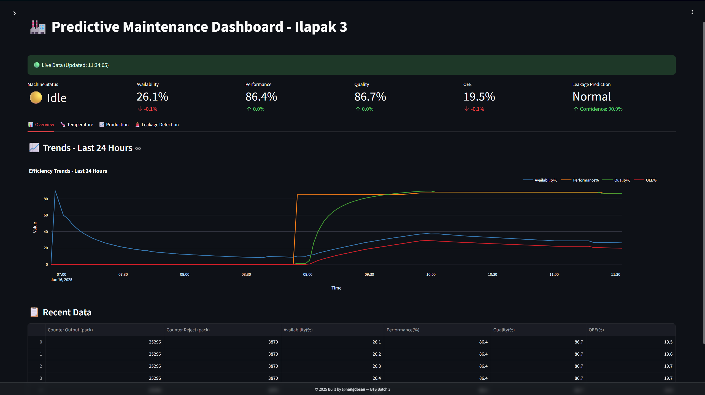
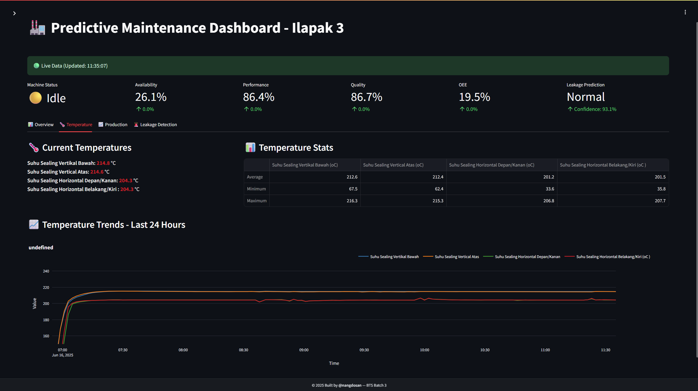
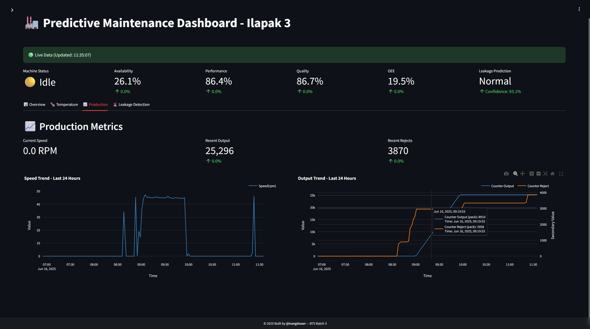
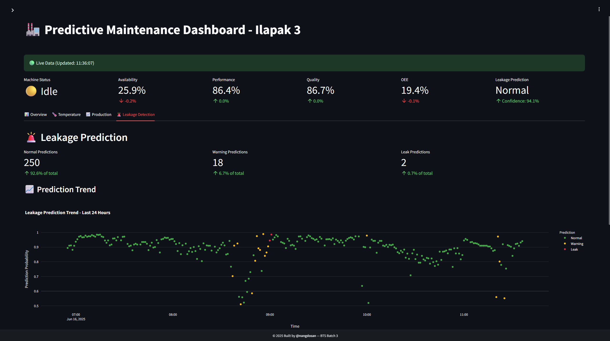

# PdM Dashboard

A real-time predictive maintenance dashboard for industrial equipment monitoring using Machine Learning approach for anomaly detection, specifically designed for Ilapak 3 packaging machine.

## 🏭 Overview

The following dashboard views display key metrics for monitoring the Ilapak 3 packaging machine:


_Overview Tab: Displays real-time OEE, Availability, Performance, and Quality metrics_


_Temperature Tab: Monitors temperature from 4 sealing_


_Production Tab: Tracks production speed (RPM), output count, and reject rate_


_Leakage Prediction Tab: Shows ML-based leakage predictions with confidence scores and status distribution_

This project implements a comprehensive predictive maintenance solution that:

- **Monitors** real-time industrial equipment data
- **Predicts** potential leakages and anomalies using machine learning
- **Visualizes** operational metrics through an interactive dashboard
- **Alerts** operators about potential maintenance needs

## 🚀 Features

### Real-time Dashboard

- **Live Data Monitoring**: Auto-refreshing dashboard with configurable intervals
- **Multi-tab Interface**: Overview, Temperature, Production, and Leakage Detection tabs
- **Interactive Charts**: Plotly-based visualizations with zoom and hover capabilities
- **Status Indicators**: Machine status, data freshness, and connection health

### Predictive Analytics

- **Leakage Prediction**: ML-powered anomaly detection with confidence scores
- **Batch Processing**: Optimized inference for historical data analysis
- **Performance Metrics**: OEE, Availability, Performance, and Quality tracking
- **Temperature Monitoring**: Multi-sensor temperature tracking with thresholds

### Technical Features

- **Caching Strategy**: Multi-level caching for optimal performance
- **Database Integration**: MySQL connection with connection pooling
- **Responsive Design**: Mobile-friendly interface with modern styling
- **Error Handling**: Comprehensive error handling and logging

## 📋 Requirements

### System Requirements

- Python 3.11+
- MySQL Database
- 4GB+ RAM (recommended)
- Modern web browser

### Dependencies

See `pyproject.toml` for complete dependency list. Key packages:

- **Streamlit**: Web dashboard framework
- **Plotly**: Interactive visualizations
- **Scikit-learn**: Machine learning pipeline
- **LightGBM**: Gradient boosting model
- **SQLAlchemy**: Database ORM
- **Pandas/NumPy**: Data processing

## 🛠️ Installation

### 1. Clone Repository

```bash
git clone <repository-url>
cd lstm-ae-anomaly-detection
```

### 2. Environment Setup

```bash
# Create virtual environment
python -m venv venv
source venv/bin/activate  # Linux/Mac
# or
venv\Scripts\activate     # Windows

# Install dependencies
pip install -e .
```

### 3. Database Configuration

Create `.env` file:

```env
DB_USER=your_username
DB_PASSWORD=your_password
DB_HOST=localhost
DB_NAME=your_database
```

### 4. Model Setup

Ensure model file exists at:

```
src/models/v1/ilapak3/lgbm-model-ilapak3-v1.0.0.pkl
```

## 🚦 Usage

### Start Dashboard

```bash
python main.py
```

### Access Dashboard

Open browser and navigate to: `http://localhost:8501`

### Dashboard Controls

- **Auto Refresh**: Toggle real-time updates (30s-5min intervals)
- **Time Range**: Select historical data range (1 hour - 30 days)
- **Manual Refresh**: Force data refresh
- **Tab Navigation**: Switch between different monitoring views

## 📊 Dashboard Tabs

### 1. Overview Tab

- **Efficiency Trends**: Availability, Performance, Quality, OEE metrics
- **Recent Data**: Latest operational data in tabular format
- **Historical Analysis**: Trend visualization over selected time range

### 2. Temperature Tab

- **Current Readings**: Real-time temperature from 4 sealing sensors
- **Temperature Stats**: Statistical summary (min, max, average)
- **Trend Charts**: Historical temperature patterns
- **Color-coded Alerts**: Visual indicators for temperature ranges

### 3. Production Tab

- **Speed Monitoring**: Current RPM and trend analysis
- **Output Tracking**: Production count with delta calculations
- **Reject Analysis**: Quality control metrics
- **Dual-axis Charts**: Output and reject correlation

### 4. Leakage Detection Tab

- **ML Predictions**: Real-time anomaly detection results
- **Prediction Statistics**: Normal/Warning/Leak distribution
- **Confidence Scores**: Model certainty indicators
- **Historical Trends**: Pattern analysis over time

## 🔧 Configuration

### Dashboard Settings (`src/dashboard/config/settings.py`)

```python
# Refresh intervals (seconds)
REFRESH_INTERVALS = [30, 60, 120, 300]
DEFAULT_REFRESH_INTERVAL = 60

# Temperature thresholds (°C)
TEMP_WARNING_THRESHOLD = 150
TEMP_DANGER_THRESHOLD = 250

# Performance thresholds (%)
PERFORMANCE_WARNING_THRESHOLD = 70
QUALITY_WARNING_THRESHOLD = 95
OEE_WARNING_THRESHOLD = 70
```

### Database Optimization

- **Connection Pooling**: Automatic connection management
- **Query Optimization**: Indexed queries with time-based filtering
- **Data Sampling**: Smart sampling for large datasets
- **Caching Strategy**: Multi-level caching (10s-60s TTL)

## 📁 Project Structure

```
lstm-ae-anomaly-detection/
├── main.py                     # Application entry point
├── pyproject.toml             # Project configuration
├── src/
│   ├── dashboard/             # Dashboard application
│   │   ├── app.py            # Main dashboard logic
│   │   ├── components/       # Reusable UI components
│   │   ├── tabs/            # Dashboard tab implementations
│   │   ├── utils/           # Utility functions
│   │   └── config/          # Configuration settings
│   └── models/              # ML model storage
└── README.md                # This file
```

## 🔒 Security Considerations

- **Environment Variables**: Sensitive data stored in `.env` file
- **SQL Injection Protection**: Parameterized queries via SQLAlchemy
- **Connection Security**: SSL/TLS support for database connections
- **Input Validation**: Data sanitization and type checking

## 📈 Performance Optimization

### Caching Strategy

- **Data Caching**: 10-60s TTL based on data freshness requirements
- **Prediction Caching**: 15-30s TTL for ML inference results
- **Connection Pooling**: Reuse database connections
- **Smart Sampling**: Reduce data points for large time ranges

### Memory Management

- **Batch Processing**: Process large datasets in chunks
- **Cache Cleanup**: Automatic cleanup of expired cache entries
- **DataFrame Optimization**: Efficient pandas operations
- **Memory Monitoring**: Built-in memory usage tracking

## 🐛 Troubleshooting

### Common Issues

**Database Connection Failed**

- Check `.env` file configuration
- Verify database server is running
- Test network connectivity

**Model Loading Error**

- Ensure model file exists at correct path
- Check file permissions
- Verify model compatibility

**Performance Issues**

- Reduce refresh interval
- Decrease historical data range
- Check system resources

**Data Not Updating**

- Verify auto-refresh is enabled
- Check database data freshness
- Manual refresh to force update

## 🧪 Development

### Local Development

```bash
# Install in development mode
pip install -e .

# Run with debug mode
streamlit run src/dashboard/app.py --server.enableWebsocketCompression=false
```

### Code Quality

- **Type Hints**: Comprehensive type annotations
- **Error Handling**: Graceful error recovery
- **Logging**: Structured logging with different levels
- **Documentation**: Inline code documentation

## 📝 License

This project is part of BTS Batch 3 program.

## 👥 Credits

**Built by @nangdosan** - BTS Batch 3

---

For detailed documentation of individual components, see the respective folder documentation files.
